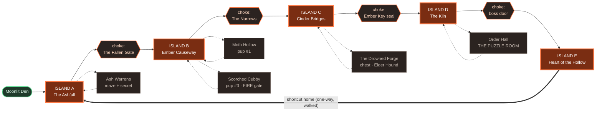
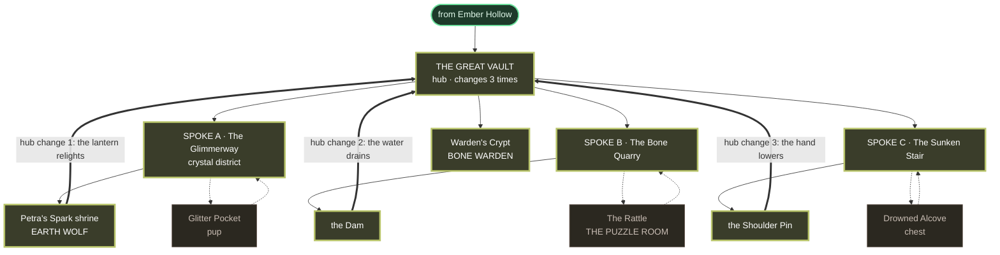
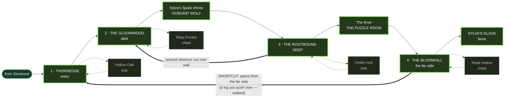

> **CHANGELOG (2026-08-07, build pass).** Cinder Bridges' hero prop was
> written as **THE GREAT CHAIN**. There is no chain model in any GREEN-bucket
> pack, and NO FAKE FICTION forbids naming a thing the game does not show, so
> it is now **THE BROKEN SPAN** — built from real `bridge-stone.glb` sections.
> Same job (a colossal ruined crossing you remember the district by), same
> place, a silhouette that actually exists.

# Level Map — Levels 1–3 (Ember Hollow · Stoneroot Caverns · Wild Woods)

> **THIS REWRITE (2026-08-07) — what changed and why**
>
> Dad: *"Levels 1 through 3 are currently small and linear. I want them much
> bigger and much less linear."* Docs only; no code was touched.
>
> **The measurement that drove everything.** The current levels average
> **185–204 square units per room, crossed in 3.0 seconds** at Kael's walking
> speed. That single number explains the complaint: a space you cross in three
> seconds cannot contain an approach, an encounter and a recovery, so every
> room is one beat long. Pacing therefore has to happen *between* rooms, which
> is exactly what makes a level feel like a corridor. Every size target below
> is derived from "what is the smallest space that can hold its own
> peak-and-valley", not from a multiplier picked for effect.
>
> | | was | becomes | why |
> |---|---|---|---|
> | **L1 shape** | 8 rooms in a line + 1 branch | **string of pearls** — 5 open islands, 4 chokepoints, 5 optional pockets | safest first-level topology: feels open, order still obvious |
> | **L2 shape** | 5 rooms in a line | **hub-and-spoke** — one great hub, 3 spokes, hub visibly changes on every return | return trips must read as progress, not backtracking |
> | **L3 shape** | 7 rooms in a line | **loopback ring** — 4 districts around a ring, shortcuts opening from the far side | the payoff shape, once they can handle it |
> | **Ability timing** | L2 + L3 grant the wolf form at the **boss** | granted **mid-level at a spirit-spark shrine**, as L1 already does | you cannot teach a tool in four steps if it arrives in the last room |
> | **Wayfinding** | text + Pip's voice | **colour district + floor pattern + hero prop + light trail + breadcrumbs** | the kids are 5–9 and cannot be assumed to read |
> | **Secrets** | 17 of 27 rooms had none | ~1 per space, always findable by looking | |
> | **Loop-back** | Ember only | every level | no re-walking a cleared level the long way |
>
> **Three existing laws are preserved, not overridden:**
> - *One puzzle room per level* (dad, v3.18) still holds. The four teaching
>   steps are **not** four puzzle rooms — introduce and develop are inline
>   obstacles measured in seconds, the **twist is the one dedicated puzzle
>   room**, and conclude happens inside the boss fight.
> - *Nothing teleports the player* (dad, v3.18). Every shortcut below is a door
>   or a ledge you choose to walk through. No drop-holes.
> - *No fake fiction* (dad, v3.18). Every landmark and every state-change below
>   is something visibly on screen — no machinery that isn't modelled.
>
> **Superseded:** the 3-room diagram and the Ember Hollow 2.0 addendum that
> used to live in this file are kept at the bottom as history.
> `ember-hollow-map.svg` is **retired** (it showed a layout three rewrites out
> of date); the new schematic is `levels-1-3-topology.svg`.

---

## THE HIDDEN SPINE — the rule everything else hangs off

Under every layout below there is a **guaranteed linear critical path**. The
optional rooms and shortcut loops hang off that spine like beads off a wire.
This is how the original *Legend of Zelda* dungeons worked: the side paths
create the feeling of open exploration, but a child who simply visits every
room they can see will always find the way forward.

Two consequences, both non-negotiable:

- **The spine is completable with zero optional content.** No pup, no chest, no
  secret is ever required to finish a level.
- **Every optional area loops back onto the spine. There are no dead ends.**
  An optional pocket either returns you to where you entered, or opens a
  one-way gate onto the spine further along.

Each level below documents its spine explicitly, so it can be traced on the map.

---

## THE WAYFINDING SYSTEM (shared across all three levels)

The camera is top-down. There is no skyline, so the usual trick — "head toward
the tower" — is unavailable. Five cues replace it, in the order a lost child
actually uses them:

1. **District colour.** Each district has its own palette. Colour-coded biomes
   are the single strongest top-down navigation tool: children recall "the
   orange bit" instantly, long before they could read a map.
2. **Floor pattern.** Each district has a distinct floor. Colour tells you
   *where you are*; the floor confirms it when you are standing on a boundary.
3. **A hero prop.** One visually dominant object per district that pulls the
   eye and anchors memory — "the big chain", "the stone giant", "the face
   tree". Placed so it is visible from most of the district.
4. **Light trails.** Torches, campfires and glowing plants laid *along the
   intended path*. Light is a stronger pull than any arrow.
5. **Breadcrumbs.** A finite trail of collectibles on the critical path.

**Breadcrumbs are the spirit's trail.** Twelve **Sparks** per level, drifting
just above the ground along the spine. They are finite, they are story (the
trapped spirit reaching toward you), and they are *not* scattered into corners
— a Spark always means "this way". Collecting all twelve is a small bonus, but
their real job is to point.

**Start subtle.** Everything above is the baseline. Stronger aids — a bigger
arrow, a louder Pip, a glowing path — get added **only where kid-testing shows
them getting lost**, never pre-emptively. Over-signposting the first playthrough
is how you remove the pleasure of finding things.

---

## THE FOUR-STEP TEACH (shared)

Each level grants **exactly one** new ability, and each level's locks are
obstacles only that ability opens.

| Step | What it is | Where it lives |
|---|---|---|
| **1 Introduce** | Safe. No threat, no timer, one obstacle. The verb, alone. | The spirit-spark shrine |
| **2 Develop** | Slightly harder — a second variable (a timer, or an enemy nearby). | The path out of the shrine |
| **3 Twist** | The verb used in a way they did not expect. | **The level's one puzzle room** |
| **4 Conclude** | A big, satisfying final use. | Inside the boss fight |

**Nothing new is introduced after the twist.** The last stretch of every level
is composition, not instruction.

**Every gate is foreshadowed before the tool exists**, so the child builds a
mental to-do list. A gate they cannot yet pass must read as **"later"**, never
as "broken":

- ✅ a cracked wall · a charred vine · a coloured door · a gap you can plainly
  see across — **with the reward visible on the far side**
- ❌ a blank grey wall. That reads as "never" and is wrong for a temporary gate.

---

## CHILD-SAFETY RULES (apply to all three levels)

- **No dead ends. No unwinnable states. No permanent loss of anything.**
- Checkpoints are generous: one at every rest point, and one immediately before
  every boss door. Respawn is at full hearts.
- The critical path is completable **without any optional content**.
- Collectibles are **finite and meaningful**: 12 Sparks, 3 pups, a handful of
  chests per level. The map is never carpeted.
- **A natural stopping point every 15–30 minutes** — a campfire rest with an
  instant resume, so a session can end without an argument.

---
---

# LEVEL 1 — EMBER HOLLOW
### Topology: wide-linear "string of pearls"

A sequence of **open islands joined by chokepoints**. The safest topology for a
first level: each island is wide enough to wander and to hold its own little
arc, but the chokepoints make the order obvious. A child who only ever walks
forward still finishes.

### Bubble diagram



**Solid = the spine. Dotted = optional, and every one returns to the spine.**

### The hidden spine (traceable, no optional content)

> Den → **Ashfall** → Fallen Gate → **Causeway** → Narrows → **Cinder Bridges**
> → *(Ember Key)* → Ember Key seal → **Kiln** → *(Fire Wolf at the shrine)* →
> boss door → **Heart of the Hollow** → Shadowgrip → Cinder freed.

Everything else — the Warrens, both pups, the Drowned Forge, the Order Hall —
can be skipped entirely.

### Districts

| Island | Palette | Floor | Hero prop | Light trail |
|---|---|---|---|---|
| **A · The Ashfall** | ash grey + cold blue shadow | fine grey ash, boot prints stay | **THE FALLEN GATE** — a toppled stone arch you walk *under* | Pip's lantern only; first torches appear at the choke |
| **B · Ember Causeway** | orange over black | cracked basalt, glowing seams | **THE KILN** — the volcano cone, visible from every island | a line of standing torches |
| **C · Cinder Bridges** | deep red, black rock, lava glow | dark slabs over lava, gaps you see through | **THE BROKEN SPAN** — a collapsed stone bridge, its sections tipped and sagging over the chasm | lava-light from below |
| **D · The Kiln** | gold + amber, warm | fitted hexagonal firebrick | **THE FORGE HEART** — a brazier bowl the size of a room | braziers you light yourself |
| **E · Heart of the Hollow** | black + violet (the shadow's colour) | obsidian, mirror-dark | **CINDER'S CAGE** | only the cage's smothered light |

Note the arc: the palette warms from grey → orange → red → gold as you go in,
then goes cold violet at the boss. The child feels the level's shape in colour
before they can articulate it.

### The ability: FIRE WOLF

Granted at **the Forge Heart shrine, mid-level** (island D) — already
user-approved canon, and the reason this level's teach works.

1. **Introduce** — *the shrine alcove.* One cold brazier, no enemies, no timer.
   Slam. It lights. A door opens. That is the whole lesson.
2. **Develop** — *the Gutter Run, on the way out of the shrine.* Three braziers
   along a channel; the flame creeps back down the gutter if you dawdle. Same
   verb, now with a clock. Still no combat.
3. **Twist — THE ORDER HALL (this level's one puzzle room).** Four braziers must
   be lit in the order their pilot-flames flicker — **but the hall is dark**, so
   the order can only be read as the **Dark Wolf**. The new tool needs the old
   tool to be usable. That is the unexpected turn.
4. **Conclude** — *the boss.* Cinder's cage is smothered by four shadow-braziers.
   Each time the Shadowgrip collapses, you get a window to slam one alight; the
   shell visibly thins. The final use of the gift is what frees the spirit.

### Gates, foreshadowed before the tool exists

| Gate | Where | Reads as "later" because | Reward visible? |
|---|---|---|---|
| Charred vine cubby | Island A | vines are *scorched* — fire-shaped | yes — **pup #3** sits behind it |
| Burnt rope bridge | Island B | the ropes are visibly burnt through | yes — a chest across the gap |
| Brazier-locked door | Island C | cold braziers flank it, light spills underneath | yes — light and a chest edge |
| **Cracked boulder** | Island B | glittering cracks | yes — **and this one is Level 2's tool**, seeded a whole level early |

### Beat chart

Rest points were placed first; the peaks were then hung between them.

| min | beat | space | intensity |
|---|---|---|---|
| 0–2 | arrival, Pip's line, first steps | Ashfall | 1 ▁ |
| 2–5 | first Shades, tap-to-attack | Ashfall | 2 ▂ |
| 5–6 | **REST — Fallen Gate campfire** | choke | 1 ▁ |
| 6–11 | moth dive-run over the seams | Causeway | 3 ▃ |
| 11–14 | geyser crossing (pure skill, no enemy) | Causeway | 3 ▃ |
| 14–15 | **REST — the Watchfire** | Causeway | 1 ▁ |
| 15–21 | lava-slab crossings, Elder Hound | Cinder Bridges | 4 ▄ |
| 21–22 | **REST — before the seal** | choke | 1 ▁ |
| 22–25 | the shrine — wonder, not threat | Kiln | 2 ▂ |
| 25–29 | the Gutter Run (timed) | Kiln | 3 ▃ |
| 29–34 | Order Hall + Cinder Shades (fire-resistant!) | Order Hall | 4 ▄ |
| 34–35 | **REST — Kiln campfire · STOPPING POINT** | Kiln hub | 1 ▁ |
| 35–42 | **THE SHADOWGRIP** | Heart | 5 █ |
| 42–45 | Cinder freed, the Hollow heals, shortcut home | Heart → A | 1 ▁ |

```
5 ┤                                            ███
4 ┤              ████            ████          ███
3 ┤      ████    ████      ████  ████          ███
2 ┤  ██  ████    ████  ██  ████  ████    ██    ███
1 ┤██  ▁▁    ▁▁      ▁▁        ▁▁    ▁▁    ▁▁     ▁▁▁
  └──┴───┴───┴───┴───┴───┴───┴───┴───┴───┴───┴───┴───
  0  5   10  15  20  25  30  35  40  45 min
```

Compression and release at every transition: each chokepoint is a **tight
passage that opens into a wide space**. The Fallen Gate is the clearest — you
squeeze under a fallen arch and the Causeway opens out in front of you with the
Kiln smoking on the horizon.

### Scale

| | now | target |
|---|---|---|
| spaces | 8 | **14** (5 islands + 4 chokes + 5 pockets) |
| area | 1,484 sq-u | **≈ 6,300 sq-u — 4.3×** |
| island size | — | **32 × 26** (crossed in ~7s) |
| choke size | — | **14 × 10** (crossed in ~2.5s) |

**Why 4.3× and not some other number.** An island has to hold approach →
encounter → recovery *inside itself*. An encounter runs 20–30 seconds, and the
approach and recovery need to be long enough to feel like separate moments —
roughly 3 seconds each. That sets the minimum crossing at ~7 seconds, which at
4.6 u/s is ~32 units. Five of those, plus tight chokes for contrast and five
small pockets, lands at 6,300. The chokes are deliberately kept *at* today's
room size — the compression only reads if there is something to compress
against.

---
---

# LEVEL 2 — STONEROOT CAVERNS
### Topology: hub-and-spoke

A central hub with three spokes. The hub is the level's memory anchor, and
**it visibly changes every time you come back** — that is the difference
between a hub that feels like progress and one that feels like backtracking.

### Bubble diagram



### The hidden spine

> Hub → **Spoke A** *(forced first — the only open door)* → Earth Wolf → hub
> **lights up** → **Spoke B** *or* **Spoke C**, either order → hub **drains** →
> the other spoke → hub **hand lowers** → boss ramp → **Bone Warden** → Petra freed.

The genuine choice is B-then-C or C-then-B. The spine is guaranteed because
only one door is ever open at the start, and the boss ramp only forms when both
have been done.

### The hub changes — the heart of this level

The hub is **The Great Vault**: a cavern with a dead **stone titan** slumped
against the far wall (hero prop). Each spoke ends by doing something to the
titan, and the change is waiting for you the moment you walk back in.

| Return | What changed | What it opens |
|---|---|---|
| **1** | the titan's **lantern relights** — the vault goes from near-dark to warm amber | a side path you literally could not see before |
| **2** | the **water drains** — a sunken ring becomes walkable, glowing mushrooms bloom in the wet mud | the floor of the vault, and a chest that was underwater |
| **3** | the titan's **hand lowers** into a ramp | the boss door |

This is also the level's **mid-dungeon twist** (the thing every region has been
missing): one flag, rebuilt rooms, and the space you know best reads differently
each time.

### Districts

| Space | Palette | Floor | Hero prop |
|---|---|---|---|
| **The Great Vault** (hub) | slate grey warming to amber | huge fitted flagstones, a cracked ring | **THE STONE TITAN** |
| **A · The Glimmerway** | cyan + white, cold sparkle | pale gravel, crystal shards underfoot | **THE GEODE** — a split crystal taller than Kael |
| **B · The Bone Quarry** | bone white + tan dust | quarried steps, chalk dust | **THE RIBCAGE** — a colossal fossil arch |
| **C · The Sunken Stair** | deep blue-green, wet | wet stone, standing water | **THE DROWNED DOOR** — a stone door half-submerged |
| **Warden's Crypt** | black + bone | polished tomb slabs | **THE WARDEN'S THRONE** |

### The ability: EARTH WOLF

**Change from current build:** granted at **Petra's Spark shrine at the end of
Spoke A**, not after the boss. Same pattern Ember already uses and dad already
approved — the spirit's *spark* reaches out mid-level; freeing **Petra** herself
stays the emotional climax at the Warden.

1. **Introduce** — *the shrine.* One cracked pile, no enemies. Stomp. It breaks.
2. **Develop** — *Spoke A's return leg.* Cracked piles with skeletons standing
   near them; now you have to pick your moment.
3. **Twist — THE RATTLE (the one puzzle room, in Spoke B).** The stomp does not
   only break rock — it **shakes**. Stomping the resonant floor plate rings the
   whole chamber: stalactites drop on whatever is beneath them, and a distant
   bell-stone answers, opening a door you cannot see from here. The verb they
   thought was a hammer turns out to be a *sound*.
4. **Conclude** — *the Bone Warden.* His tower shield front-blocks everything,
   but a stomp at his feet staggers him off his guard. The gift is the answer to
   the boss.

### Gates, foreshadowed

| Gate | Where | Reads as "later" | Reward visible? |
|---|---|---|---|
| Cracked boulder | **back in Ember Hollow, Level 1** | glittering cracks | yes — a chest |
| Cracked piles | hub + both early spokes | same glitter, same shape | yes |
| Bramble tangle | Spoke C | green, alive, wrong for a cave | yes — **Level 3's tool**, seeded early |
| Underwater door | hub | you can see it through the water | yes — becomes reachable at hub-change 2 |

### Beat chart

| min | beat | space | intensity |
|---|---|---|---|
| 0–2 | descent, the vault opens up (release) | Hub | 1 ▁ |
| 2–4 | **REST — Old Bram's camp** | Hub | 1 ▁ |
| 4–9 | Spoke A: slimes, crystal narrows | Glimmerway | 3 ▃ |
| 9–12 | the Geode climb, bats | Glimmerway | 3 ▃ |
| 12–14 | **the shrine — EARTH WOLF** (wonder) | shrine | 2 ▂ |
| 14–16 | **REST + hub change 1 (the lantern)** | Hub | 1 ▁ |
| 16–22 | Spoke B: quarry, Bone Brutes | Bone Quarry | 4 ▄ |
| 22–27 | **THE RATTLE** (puzzle room) | Bone Quarry | 3 ▃ |
| 27–29 | **REST + hub change 2 (the water drains) · STOPPING POINT** | Hub | 1 ▁ |
| 29–36 | Spoke C: shieldlings, wet stair | Sunken Stair | 4 ▄ |
| 36–38 | **REST + hub change 3 (the hand lowers)** | Hub | 1 ▁ |
| 38–46 | **THE BONE WARDEN** | Crypt | 5 █ |
| 46–48 | Petra freed, the caverns bloom | Crypt | 1 ▁ |

```
5 ┤                                          ███
4 ┤                  ████        ████        ███
3 ┤      ████ ████         ████  ████        ███
2 ┤      ████ ████  ██     ████  ████        ███
1 ┤▁▁ ▁▁                ▁▁     ▁▁      ▁▁       ▁▁
  └──┴───┴───┴───┴───┴───┴───┴───┴───┴───┴───┴────
  0  5   10  15  20  25  30  35  40  45  48 min
```

The hub is a **release** space every single time — wide, safe, changed. The
spokes are the compression. That rhythm is the level.

### Scale

| | now | target |
|---|---|---|
| spaces | 5 | **17** (hub + 3 spokes × 3 + 3 pockets + crypt + 2 chokes) |
| area | 1,012 sq-u | **≈ 7,300 sq-u — 7.2×** |
| hub | — | **36 × 28** |

**Why 7.2×, the biggest jump of the three.** The hub is crossed **six times**.
A space crossed six times has to be worth crossing: big enough that a lit corner
which was dark before is a genuine discovery, and big enough that the drained
floor is a new *place* rather than a new tile. That alone accounts for a fifth
of the level. The other four fifths are three spokes that each need a full arc
of their own — this is structurally three mini-levels plus a room that changes
three times, where there used to be five rooms in a line.

---
---

# LEVEL 3 — WILD WOODS
### Topology: loopback and branching

A path that **curves back on itself**, with shortcuts that open from the far
side. By level three the kids have the vocabulary for it: they have done open
islands and they have done a hub. Now the level itself becomes the shape.

This is deliberately **not** a full interconnected Metroidvania graph — that is
too much for a five-year-old to hold. It is one ring, with a middle.

### Bubble diagram



### The hidden spine

> Thornedge → **Gloomwood** → *(Verdant Wolf at the shrine)* → **Rootbound Deep**
> → The Knot → **Bloomfall** → **Sylva's Glade** → Sylva freed.

A plain ring walked clockwise. The two shortcuts are pure convenience — they
open *from the far side*, so the child discovers them having already earned the
distance. Neither is ever required.

### Districts

| District | Palette | Floor | Hero prop |
|---|---|---|---|
| **1 · Thornedge** | sickly yellow-green, dead bracken | dry leaf litter, thorn runners | **THE LEANING SHRINE** — a toppled wolf statue, half-swallowed |
| **2 · The Gloomwood** | deep blue-green, near-dark | black moss, pale mushroom rings | **THE WATCHING TREE** — a vast hollow trunk with a face-shaped hollow |
| **3 · The Rootbound Deep** | brown + amber, close and woody | bare packed earth between roots | **THE GREAT ROOT ARCH** — roots grown into a doorway |
| **4 · The Bloomfall** | pink + white blossom — the only healthy district | pale petals, drifting | **THE BLOSSOM FALL** — a permanent cascade of petals |
| **Sylva's Glade** | green + gold | soft grass, a ring of standing stones | **SYLVA HERSELF**, thornbound |

The palette is the story: sick yellow → dark blue → brown → and then, on the far
side, one district that is already *well*. Reaching the Bloomfall tells a child
without a word that they are near the end and that the woods can be saved.

### The ability: VERDANT WOLF

**Change from current build:** granted at **Sylva's Spark shrine in the
Gloomwood**, not from Sylva at the boss. Same reason as Level 2.

1. **Introduce** — *the shrine clearing.* One bramble across a doorway. Lash. Cut.
2. **Develop** — *the way out.* Brambles that **grow back** if you dawdle, and a
   bramble rope you lash to swing a fallen log into place as a bridge.
3. **Twist — THE KNOT (the one puzzle room).** The lash does not only cut — it
   **holds**. Tether a boulder and *drag* it; snare a Thorn Hound and hold it
   still. The tool they learned as a blade turns out to be a rope.
4. **Conclude** — *the Bloomfall's great thorn-knot*, which is what opens the
   Glade — and then Sylva herself, whose thorns are cut with the gift she sent.

### Gates, foreshadowed

| Gate | Where | Reads as "later" | Reward visible? |
|---|---|---|---|
| Bramble tangle | **back in Stoneroot, Level 2** | green and alive in a cave — obviously wrong | yes — a gold chest |
| Bramble walls | Thornedge, before the shrine | same tangle, same look | yes |
| **Ice-sealed spring** | Thornedge | pale blue, glittering, cold | yes — **Level 4's tool**, a whole level early |
| Root-wall shortcut | Rootbound | woven roots, light through the gaps | yes — you can see the Gloomwood through it |

### Beat chart

| min | beat | space | intensity |
|---|---|---|---|
| 0–3 | the woods are wrong (quiet dread, no fight) | Thornedge | 1 ▁ |
| 3–8 | first Thorn Hounds — fire burns thorns | Thornedge | 3 ▃ |
| 8–9 | **REST — the Leaning Shrine** | Thornedge | 1 ▁ |
| 9–15 | the dark — Dark Wolf eyes, wisp moths | Gloomwood | 4 ▄ |
| 15–17 | **the shrine — VERDANT WOLF** | shrine | 2 ▂ |
| 17–19 | **REST — the Watching Tree** | Gloomwood | 1 ▁ |
| 19–26 | regrowing brambles, the log bridge | Rootbound | 3 ▃ |
| 26–31 | **THE KNOT** (puzzle room) | Rootbound | 3 ▃ |
| 31–33 | **REST · STOPPING POINT** — and the first shortcut opens | Rootbound | 1 ▁ |
| 33–40 | the pack — Elder Thorn Hounds | Bloomfall | 4 ▄ |
| 40–43 | the great thorn-knot; the district blooms | Bloomfall | 2 ▂ |
| 43–45 | **REST — before the glade** | Bloomfall | 1 ▁ |
| 45–53 | **SYLVA, THORNBOUND** | Glade | 5 █ |
| 53–56 | Sylva freed, the woods green, ring closes | Glade → T | 1 ▁ |

```
5 ┤                                              ███
4 ┤          ████                    ████        ███
3 ┤    ████       ████  ████  ████   ████        ███
2 ┤    ████  ██   ████  ████  ████   ████  ██    ███
1 ┤▁▁▁     ▁▁   ▁▁               ▁▁          ▁▁     ▁▁▁
  └──┴───┴───┴───┴───┴───┴───┴───┴───┴───┴───┴───┴────
  0  5   10  15  20  25  30  35  40  45  50  55 min
```

The ring gives pacing a gift the earlier shapes cannot: **the return leg is
short**. After the longest, hardest stretch, home is two rooms away instead of
seven. That is why the shortcuts open from the far side and not the near one.

### Scale

| | now | target |
|---|---|---|
| spaces | 7 | **18** (4 districts × 2 + glade + shrine + puzzle + 4 chokes + 4 pockets + 2 shortcut legs) |
| area | 1,428 sq-u | **≈ 8,300 sq-u — 5.8×** |
| district space | — | **32 × 26**, ring legs **26 × 20** |

**Why 5.8×.** A loop only reads as a loop if the return leg felt like a journey
— a ring you can see across is not a ring, it is a room with a pillar in it. The
walk from Thornedge round to the Bloomfall has to be long enough that finding
the shortcut back is a *relief*, which means roughly ten minutes of travel in
the outward direction. Four districts at 32 × 26 plus their connecting legs is
the smallest ring that buys that feeling.

---
---

# APPENDIX — at-a-glance tables (all three levels)

### Collectibles (finite, on purpose)

| Level | Sparks | Pups | Chests | Heart piece |
|---|---|---|---|---|
| 1 Ember Hollow | 12 | 3 | 5 | 1 (all 3 pups) |
| 2 Stoneroot | 12 | 3 | 6 | 1 (all 3 pups) |
| 3 Wild Woods | 12 | 3 | 6 | 1 (all 3 pups) |

### Rest points and stopping points

| Level | Rests | Natural stopping point |
|---|---|---|
| 1 | 5 (+ Den) | the Kiln campfire, ~34 min |
| 2 | 5 | hub change 2, ~28 min |
| 3 | 5 | after The Knot, ~32 min |

### One ability per level, one puzzle room per level

| Level | Ability | Granted at | The puzzle room (the twist) |
|---|---|---|---|
| 1 | **Fire Wolf** | Forge Heart shrine (mid) | **The Order Hall** — read the order in the dark |
| 2 | **Earth Wolf** | Petra's Spark shrine (mid) | **The Rattle** — the stomp is a *sound* |
| 3 | **Verdant Wolf** | Sylva's Spark shrine (mid) | **The Knot** — the blade is a *rope* |

### Total build implication

| | now | proposed |
|---|---|---|
| spaces, levels 1–3 | 20 | **49** |
| area, levels 1–3 | 3,924 sq-u | **≈ 21,900 sq-u (5.6×)** |
| est. playtime, levels 1–3 | ~45 min | **~2h 30m** |

---
---

# HISTORY — superseded designs

Everything below is kept for the record and is **not** the current design.

<details>
<summary>The original 3-room slice (2026-07) and the Ember Hollow 2.0 addendum (v3.0)</summary>

**Original slice critical path:** Arrive (R1) → learn move + attack → *(Dark
Wolf nook → Pup #1)* → CP1 → cross R2 (moths, geysers) → *(beat Shadow Hound →
Pup #2)* → CP2 → boss door → **Shadowgrip** (R3) → free Cinder → **gain Fire
Wolf** → backtrack, burn obstacle → Pup #3 → all 3 pups = **+1 heart** → exit
toward Earth (Luna dream).

**Ember Hollow 2.0 (v3.0 rework):**

```
 DEN(settlement) — R1 ENTRANCE — R1b ASH WARRENS (maze, secret, one-way drop)
                     |
                  R2 CAUSEWAY — R2b CINDER BRIDGES (branch: hound → EMBER KEY;
                     |            water gate ??? promise)
        boulder ??? -+           EMBER KEY also cools the region's lava (twist)
                     |
              [EMBER KEY seal]
                     |
              THE KILN — K1 HUB (campfire, 3 doors)
          |A open      |B brazier-locked  |C key
        KA SHRINE     KB ORDER PUZZLE     R3 BOSS
        FIRE WOLF     → KILN KEY          Shadowgrip
```

The Fire Wolf timing change (granted at the KA shrine mid-dungeon) survives into
the design above and is the model for Levels 2 and 3.

</details>
